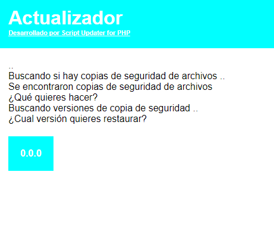
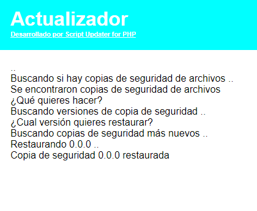

[English](readme.md)

# Actualizador de Scripts para PHP

Actualizador de Scripts para PHP es un script de actualización que se puede usar con cualquier proyecto de PHP pata actualizar los archivos con un par de clics.
El script solamente requiere que puede leer un archivo que contiene la versión actual, sistema de archivos locales, y ubicación de archivos remotos. Se puede
usar Amazon S3 si uno quiere.

## Capturas de Pantalla







## Configurar el Script de Actualización

Para usar este script de actualización se necesita crear un archivo que contiene los pasos para la actualización. Este archivo tiene que contener `version` y
`files`. Debajo `files` hay dos cosas adicionales, `add` y `delete`. La versión (`version`) tiene que ser un conjunto de números enteros separados con un punto (.)
donde el número más importante está más a la izquierda.

Los dos `add` (agregar) y `delete` (borrar) son secuenciás. Se asignan a todas los artículos un `local` (local) y un `remote` (remoto). `local` es donde quieres que vaya el archivo descargado y `remote` es donde se obtiene del servidor de actualización.

La sección de `script` define dos secciones `do` (hacer) y `undo` (deshacer). La sección do define lo que se ejecutará cuando se hayan añadido, actualizado o eliminado todos los archivos. Cada script en la sección do debe definir si debe ser borrado después de la ejecución, estableciendo `delete` como `true` (verdad) o `false` (falso). Vea el ejemplo de abajo si está confundido. En la sección de `undo` (deshacer) tiene scripts que necesitarán ser ejecutados si alguien elige revertir a una copia de seguridad. Esta sección requiere las secciones de `script`, `remote` (remoto) y `delete` (borrar). Estos scripts se añadirán al archivo de copia de seguridad y se recuperarán desde el remoto. La sección de `delete` (borrar) especifica si se borrará después de restaurar la copia de seguridad.

Si quieres que tus usuarios puedan hacer clic en un botón cuando terminen, puedes establecer `finishUrl` en el archivo YAML a una URL relativa. Cuando se haga clic en el botón irán a lo que se haya establecido. Si no existe, recibirán un mensaje de que no se ha encontrado un botón de finalización.

A continuación se muestra un ejemplo de archivo de actualización YAML:

```
version:    1.1.17
files:
        add:
            - {local: "foo/bar/writable/foobar.txt", remote: "files/foobar.txt"}
            - {local: "scripts/writefile.php", remote: "files/writefile.php.txt"}
        delete:
            - "foo/foo.txt"
scripts:
        do:
            - {script: "scripts/writefile.php", delete: true}
        undo:
            - {script: "scripts/deletefile.php", remote: "scripts/deletefile.php", delete: true}
finishUrl: "
```

## Configurar el Actualizador

Para configurar el actualizador debes editar config.php. version_url es donde pones la url base para tus archivos de actualización. version_file es el archivo de versión en el host remoto con la información a actualizar. update_folder es la carpeta en el host local que quieres que sirva de base.

## Cambiar la URL para Diferentes Versiones

Si quieres que cada versión tenga su propio script de actualización puedes asegurarte de incluir el config.php de los actualizadores en las actualizaciones con la nueva ubicación para esa versión.

## Se Admiten los Siguientes Idiomas:

| Idioma | Versión |
| --- | --- |
| Inglés | Todas |
| Español | Todas |

## Plugins

Updater permite que los plugins te hagan la vida un poco más fácil. Yo lo hice principalmente para tareas como la autorización. Para crear un plugin simplemente pon un archivo php en el directorio de plugins con una clase llamada igual. Ver ejemplo.

```php
<?php
    class Authorize
    {
        // Hooks go here
    }
```

### Ganchos

#### Gancho Constructor

El hook del constructor se ejecutará cuando se llame al constructor del controlador. Por lo tanto, cualquier cosa que deba aplicarse a todas las funciones, como la autorización, debe llamarse allí. Esto se hace añadiendo la función pública de ConstructorHook() a su archivo de plugin. Los ganchos del constructor realmente deberían no hacer nada o devolver un encabezado, como prohibido si no se quiere continuar.

```php
<?php
    class Authorize
    {
        public function ContructorHook()
        {
            // Authorization logic use exit(); if you need to terminate.
        }
    }
```

Un ejemplo de un plugin de Authorize que no autorizaría a nadie es el siguiente:


```php
class Authorize
{
    public function ConstructorHook()
    {
        // authorization logic here...call exit if not
        // authorized.
        header('HTTP/1.0 403 Forbidden');
        exit();
    }
}
```

## Restauración de Copias de Seguridad

Cuando el usuario vaya a la pantalla de actualización, se comprobará la existencia de archivos de copia de backup-{versión}. Si existen, se le preguntará si desea restaurar una copia de seguridad o buscar actualizaciones.

## Pruebas de Fallos

Se usan las siguientes pruebas antes de descargar las actualization:

### Prueba de la Escritura

Todos los archivos se comprueban antes de la descarga para asegurarse de que son grabables.

### Prueba de Archivos Remotos 

Se comprueba que todos los archivos remotos existen antes de ser instalados.

## Copia de Seguridad de Archivos

Todos los archivos que se van a añadir y que existen actualmente o que se van a eliminar se añaden a un archivo de copia de seguridad llamado backup-{version}.zip en la misma carpeta que el script del actualizador.

Nota: No se toman copias de seguridad de ninguna base de datos en este momento y probablemente no sucederá en ningún momento en el futuro cercano ya que quiero que esto sea agnóstico a las bases de datos. Dicho esto, puede tomar más trabajo, pero se puede utilizar la primera posición en la sección de script para hacer una copia de seguridad de la base de datos.

La copia de seguridad contendrá un script YAML llamado restore.yml que proporcionará instrucciones sobre cómo recuperar la copia de seguridad. Simplemente contendrá dos secciones: borrar y scripts. Tendrá un aspecto similar al siguiente:

```
delete:
        - "scripts/foo.php"
        - "scripts/bar.php"
scripts:
        - {script: "scripts/rollbackmigration.php", delete: true}
```

## Herramientas

Las siguientes herramientas existen con fines de prueba o simplemente para facilitarle la vida cuando
crear un archivo de actualización.  Se pueden encontrar en la carpeta de herramientas de este repositorio. Algunos
pueden ser accedidas a través de una línea de comandos/terminal con PHP instalado otras necesitarán usar
un navegador web.

### Update Test

Este script generará dos carpetas en la raíz del repositorio, update-test y
update-test-source.  Si tiene un servidor web de prueba, puede probar si el sistema de
funciona visitando update-test.  Esto es bueno para probar las actualizaciones
y para restaurar las copias de seguridad.

Para ejecutar este script necesitará asegurarse de que el repositorio está en algún lugar donde el navegador web
pueda verlo y entonces apuntar el navegador a la URL del repositorio con el apéndice
`tools\date-test.php`.

## Aviso de Spyc

Para analizar YAML utilizamos la biblioteca Spyc de Vladimir Andersen. Esta biblioteca está licenciada bajo la licencia MIT.

## Licencia

Copyright 2020 Travis Pessetto

Por la presente se concede permiso, libre de cargos, a cualquier persona que obtenga una copia de este software y de los archivos de documentación asociados (el "Software"), a utilizar el Software sin restricción, incluyendo sin limitación los derechos a usar, copiar, modificar, fusionar, publicar, distribuir, sublicenciar, y/o vender copias del Software, y a permitir a las personas a las que se les proporcione el Software a hacer lo mismo, sujeto a las siguientes condiciones:

El aviso de copyright anterior y este aviso de permiso se incluirán en todas las copias o partes sustanciales del Software.

EL SOFTWARE SE PROPORCIONA "COMO ESTÁ", SIN GARANTÍA DE NINGÚN TIPO, EXPRESA O IMPLÍCITA, INCLUYENDO PERO NO LIMITADO A GARANTÍAS DE COMERCIALIZACIÓN, IDONEIDAD PARA UN PROPÓSITO PARTICULAR E INCUMPLIMIENTO. EN NINGÚN CASO LOS AUTORES O PROPIETARIOS DE LOS DERECHOS DE AUTOR SERÁN RESPONSABLES DE NINGUNA RECLAMACIÓN, DAÑOS U OTRAS RESPONSABILIDADES, YA SEA EN UNA ACCIÓN DE CONTRATO, AGRAVIO O CUALQUIER OTRO MOTIVO, DERIVADAS DE, FUERA DE O EN CONEXIÓN CON EL SOFTWARE O SU USO U OTRO TIPO DE ACCIONES EN EL SOFTWARE.